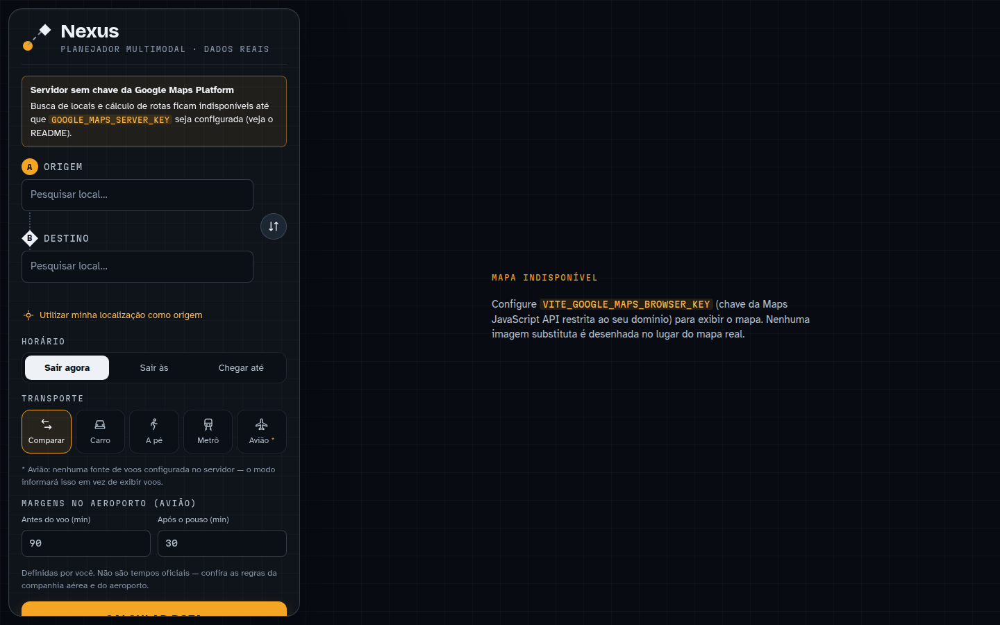
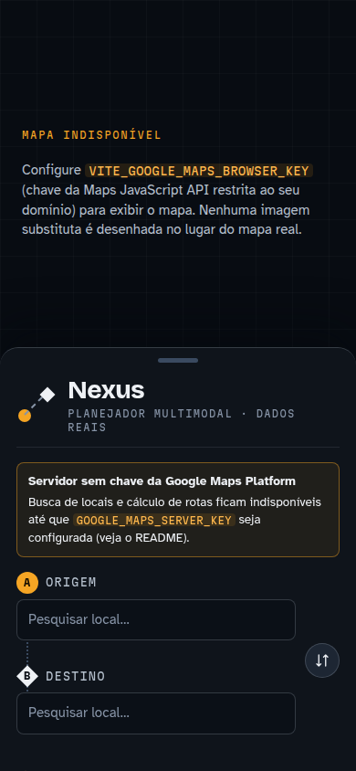

# Nexus Map

Planejador multimodal de rotas baseado em dados geográficos reais: **carro, a pé,
metrô / trilhos e avião**, com comparação objetiva, horários de saída/chegada e semáforos
com telemetria real onde ela existe.

> **Princípio do projeto:** é preferível dizer *"Não existem dados disponíveis para essa
> funcionalidade nesta localização."* do que mostrar qualquer informação inventada.

---

## Descrição

O Nexus Map recebe uma **origem** e um **destino** escolhidos em um autocomplete geográfico
real, calcula cada meio de transporte com o provedor adequado e mostra, lado a lado, duração,
distância, horários de saída e chegada (no fuso local de cada ponta), trânsito e disponibilidade.
Uma recomendação é derivada apenas de critérios numéricos dos dados retornados.

Quando um modo não existe para o trajeto (sem metrô, sem rota aérea adequada, sem voos
publicados, sem telemetria de semáforo), a interface diz isso explicitamente.

## Objetivo

Partir de um exemplo simples — "origem → destino → linha reta no mapa" — e chegar a um
planejador multimodal honesto:

```
ORIGEM
├── 🚗 Carro   ruas reais, sentido das vias, trânsito (ao vivo/previsão), alternativas, pedágio, ETA
├── 🚶 A pé    rota de pedestre própria (beta do provedor, com aviso), ETA
├── 🚇 Metrô   caminhada → estação → linha/sentido → baldeações → estação → caminhada, horários
└── ✈ Avião    carro até o aeroporto → margem do usuário → voo direto publicado → margem → carro
MAPA     Normal · Satélite · Híbrido · Terreno · 3D
TEMPO    Sair agora · Sair às · Chegar até
ANÁLISE  duração · distância · saída · chegada · trânsito · disponibilidade · melhor opção
SEMÁFOROS localização · fase real (se houver) · tempo restante (se a fonte publicar) · "indisponível"
```

## Demonstração

| Desktop (painel lateral + mapa) | Celular (mapa + painel inferior) |
|---|---|
|  |  |

As capturas mostram o estado inicial **sem credenciais configuradas**: o mapa não é desenhado
(não há imagem substituta) e o painel avisa qual chave falta. Com as chaves do Google
configuradas, o mapa real aparece atrás do painel.

Fluxo de uso:

1. Digite a origem (ou "Utilizar minha localização") e escolha uma sugestão da lista.
2. Digite o destino e escolha uma sugestão (texto livre não é aceito).
3. Escolha **Sair agora**, **Sair às** (fuso da origem) ou **Chegar até** (fuso do destino).
4. Escolha **Comparar** ou um modo específico; para avião, ajuste as margens no aeroporto.
5. **Calcular rota** → cards por modo, recomendação, detalhes passo a passo; clique em um card
   ou em uma rota alternativa no mapa para trocar.
6. No mapa: troque a camada, ligue **Trânsito** e **Semáforos**.

## Tecnologias

| Camada | Tecnologia |
|---|---|
| Front-end | React 19, TypeScript, Vite 8, CSS próprio (tokens), `@vis.gl/react-google-maps` (mapa 2D e 3D) |
| Back-end | Node.js 22, TypeScript, Express 5, zod, Helmet, `mqtt` (telemetria), esbuild (build) |
| Compartilhado | `@nexus/shared`: contrato da API, Luxon (fusos IANA), geometria, comparação/recomendação |
| Qualidade | Vitest, Testing Library, ESLint (typescript-eslint, react-hooks), Prettier |
| Fontes | Bricolage Grotesque, Atkinson Hyperlegible (legibilidade), Martian Mono — auto-hospedadas |

## Arquitetura

```
 Navegador (React)                          Servidor (Node/Express)                       Fontes externas
┌───────────────────────────┐   REST/SSE   ┌─────────────────────────────────────────┐
│ RouteForm / PlaceSearch   │ ───────────▶ │ http/routes  (validação zod, horários)   │
│ usePlanner (estado)       │              │   │                                     │
│ RouteComparison/Recommend │◀── shared ──▶│ services/                               │
│ MapService (desenho)      │              │   PlacesService ── GooglePlacesClient ───┼──▶ Places API (New)
│ MapView (Maps JS 2D/3D) ──┼──────────────┼───────────────────────────────────────── ┼──▶ Maps JavaScript API
│ SignalsPanel (EventSource)│              │   TimeZoneService ── TimeZone/Geocoding ─┼──▶ Time Zone / Geocoding API
└───────────────────────────┘              │   RouteService (carro/a pé) ┐            │
                                           │   ScheduleService (chegar até) ├ Routes ─┼──▶ Routes API
                                           │   TrafficService             │          │
                                           │   TransitService (trilhos) ──┘          │
                                           │   FlightService ─ FlightProvider ────────┼──▶ FlightAware AeroAPI
                                           │                 └ AirportDirectory ─────┼──▶ OurAirports (CSV)
                                           │   TrafficSignalService                   │
                                           │     ├ SignalLocationSource (OSM) ────────┼──▶ Overpass API
                                           │     ├ TrafficSignalProvider (Hamburgo) ──┼──▶ SensorThings + MQTT
                                           │     └ DemoTrafficSignalProvider (opt-in) │
                                           └─────────────────────────────────────────┘
```

- **Chaves privadas só no servidor.** O navegador recebe apenas a chave da Maps JavaScript API.
- **Provedores isolados** atrás de interfaces (`FlightProvider`, `TrafficSignalProvider`,
  `SignalLocationSource`, `TransitProvider`): trocar fornecedor não exige reescrever a aplicação.
- **Regras fora dos componentes**: comparação/recomendação e fusos no pacote compartilhado;
  desenho do mapa em `MapService`; integrações em `server/src/providers`.
- **Erros por modo**: cada modo devolve `available`, `unavailable` (sem opção real),
  `not_configured` (falta credencial) ou `error` (falha do provedor) — nunca uma rota substituta.

Decisões e pesquisa detalhadas: [`docs/RESEARCH.md`](docs/RESEARCH.md).
Capacidades de cada fonte: [`docs/DATA_PROVIDERS.md`](docs/DATA_PROVIDERS.md).

## Estrutura de pastas

```
.
├── client/                      # React + Vite
│   ├── src/
│   │   ├── api/client.ts        # chamadas REST com AbortController
│   │   ├── components/
│   │   │   ├── form/            # RouteForm, PlaceSearchInput (combobox ARIA)
│   │   │   ├── map/             # MapView, RouteLayers, PlaceMarkers, SignalMarkers, LayerSwitcher, Map3DView (lazy)
│   │   │   ├── results/         # ModeCards, RecommendationCard, RouteDetails
│   │   │   ├── signals/         # SignalsPanel, DemoSignalsPanel
│   │   │   ├── layout/          # BottomSheet (celular)
│   │   │   └── common/          # selos de dado, ícones, avisos, skeletons
│   │   ├── hooks/               # debounce, mídia, relógio, capacidades, camada de semáforos (SSE)
│   │   ├── services/MapService.ts
│   │   ├── state/               # usePlanner, reducer, resolução de horário/fuso
│   │   └── styles/
│   └── tests/
├── server/                      # Node + Express
│   ├── src/
│   │   ├── config/env.ts        # variáveis de ambiente (zod)
│   │   ├── http/                # rotas REST/SSE, schemas, regras de horário
│   │   ├── providers/
│   │   │   ├── google/          # Routes, Places, Time Zone, Geocoding
│   │   │   ├── flights/         # FlightProvider, AeroApiFlightProvider
│   │   │   ├── airports/        # AirportDirectory (OurAirports)
│   │   │   └── signals/         # OSM, Hamburgo (TLD + MQTT), demo
│   │   ├── services/            # Places, Route, Schedule, Traffic, Transit, Flight, TrafficSignal, ModeRunner
│   │   ├── app.ts / container.ts / index.ts
│   └── tests/ (+ fixtures/ sintéticas)
├── packages/shared/             # tipos do contrato, tempo/fuso, geometria, comparação
├── docs/                        # RESEARCH.md, DATA_PROVIDERS.md, images/
├── .env.example
└── package.json                 # npm workspaces
```

## Configuração

Pré-requisitos: **Node.js ≥ 22.12** e npm.

```bash
npm install
cp .env.example .env   # preencha as chaves (o .env não é versionado)
```

### Google Cloud (obrigatório para mapa, locais e rotas)

1. Crie/escolha um projeto com **faturamento ativo**.
2. Habilite: **Maps JavaScript API**, **Places API (New)**, **Routes API**, **Time Zone API**, **Geocoding API**.
3. Crie **duas chaves**:
   - **Navegador** (`VITE_GOOGLE_MAPS_BROWSER_KEY`): restrição de aplicativo *Sites (HTTP referrers)*
     com seus domínios (ex.: `http://localhost:5173/*`, `https://seu-dominio/*`); restrição de API:
     somente **Maps JavaScript API**.
   - **Servidor** (`GOOGLE_MAPS_SERVER_KEY`): restrição por **endereço IP** do servidor; restrição de
     API: **Routes API, Places API (New), Time Zone API, Geocoding API**.
4. Em *Map Management*, crie um **Map ID** do tipo JavaScript com renderização **Vetorial**
   (`VITE_GOOGLE_MAPS_MAP_ID`). Ele é necessário para marcadores avançados, mapa vetorial e 3D.

### Voos (opcional)

Crie uma chave em [FlightAware AeroAPI](https://www.flightaware.com/aeroapi/) e preencha
`FLIGHTAWARE_AEROAPI_KEY`. O plano *Personal* é para uso pessoal/acadêmico e limita a
10 result sets/minuto; uso comercial requer *Standard* ou *Premium*. Sem a chave, o modo Avião
mostra "não configurado".

### Semáforos (sem credenciais)

OpenStreetMap (Overpass) e Hamburg TLD são públicos. Para uso intensivo, aponte
`OVERPASS_API_URL` para uma instância própria.

## Variáveis de ambiente

| Variável | Onde | Obrigatória | Padrão | Descrição |
|---|---|---|---|---|
| `VITE_GOOGLE_MAPS_BROWSER_KEY` | navegador | para o mapa | — | Chave da Maps JavaScript API (restrita por referrer). |
| `VITE_GOOGLE_MAPS_MAP_ID` | navegador | recomendada | `DEMO_MAP_ID` | Map ID vetorial. O padrão serve só para testes. |
| `VITE_API_BASE_URL` | navegador | não | mesmo host | Base da API se o cliente estiver em outro host. |
| `PORT` | servidor | não | `8787` | Porta HTTP. |
| `CORS_ORIGIN` | servidor | não | — | Origem permitida se cliente e API estiverem em hosts diferentes. |
| `GOOGLE_MAPS_SERVER_KEY` | servidor | para locais/rotas | — | Routes, Places (New), Time Zone, Geocoding. |
| `GOOGLE_LANGUAGE_CODE` / `GOOGLE_REGION_CODE` | servidor | não | `pt-BR` / `BR` | Idioma das instruções e região de formatação. |
| `ROUTES_TRAFFIC_ON_POLYLINE` | servidor | não | `true` | Cores de trânsito na rota (SKU Enterprise). |
| `ROUTES_TOLLS` | servidor | não | `true` | Informação de pedágio (SKU Enterprise). |
| `FLIGHTAWARE_AEROAPI_KEY` | servidor | para voos | — | Chave da AeroAPI. |
| `AEROAPI_MAX_REQUESTS_PER_MINUTE` | servidor | não | `10` | Limite de consultas de voos. |
| `FLIGHT_MIN_DISTANCE_KM` | servidor | não | `100` | Abaixo disso não se buscam voos (economia de consultas; **não** é critério aeronáutico). |
| `FLIGHT_AIRPORT_SEARCH_RADIUS_KM` | servidor | não | `120` | Raio de busca de aeroportos. |
| `FLIGHT_MAX_AIRPORTS_PER_SIDE` | servidor | não | `2` | Aeroportos por lado (pares = N×N consultas). |
| `FLIGHT_MAX_OPTIONS` | servidor | não | `3` | Voos detalhados com trechos terrestres. |
| `AIRPORTS_DATA_URL` / `AIRPORTS_CACHE_DIR` | servidor | não | OurAirports / `.cache` | Base de aeroportos e cache local (7 dias). |
| `SIGNALS_OSM_ENABLED` / `OVERPASS_API_URL` | servidor | não | `true` / overpass-api.de | Localização de semáforos (OSM). |
| `SIGNALS_HAMBURG_TLD_ENABLED` | servidor | não | `true` | Telemetria real de Hamburgo. |
| `HAMBURG_TLD_BASE_URL` / `HAMBURG_TLD_MQTT_URL` | servidor | não | endpoints oficiais | SensorThings REST e MQTT (WebSocket). |
| `SIGNALS_MAX_ROUTE_KM` | servidor | não | `60` | Rotas maiores não carregam semáforos. |
| `SIGNALS_STALE_AFTER_SECONDS` | servidor | não | `300` | Idade máxima de uma fase para não ser marcada como desatualizada. |
| `TRAFFIC_SIGNAL_DEMO_MODE` | servidor | não | `false` | **Dados simulados** de semáforo (somente desenvolvimento). |
| `HTTPS_PROXY` | servidor | não | — | Proxy de saída também para o MQTT via WebSocket. |

## APIs utilizadas

### API REST do Nexus (`/api`)

| Método | Rota | Descrição |
|---|---|---|
| GET | `/health` | Saúde do servidor. |
| GET | `/capabilities` | O que está configurado (sem expor segredos). |
| GET | `/places/autocomplete?q=&session=&lat=&lng=` | Sugestões (Places Autocomplete New). |
| GET | `/places/details/:placeId?session=` | Local validado com coordenadas e fuso IANA. |
| GET | `/places/reverse?lat=&lng=` | Endereço da localização do dispositivo. |
| POST | `/routes/drive` · `/routes/walk` · `/routes/rail` | `{ origin, destination, time }` → `ModeResult`. |
| POST | `/routes/flight` | idem + `preDepartureMarginMinutes`, `postArrivalMarginMinutes`. |
| POST | `/signals/route` | `{ polyline }` → semáforos ao longo da rota de carro. |
| GET | `/signals/state?streams=` | Estado atual (ressincronização). |
| GET | `/signals/stream?streams=` | **Server-Sent Events** com cada observação real. |
| POST | `/signals/demo` | Simulação (somente com `TRAFFIC_SIGNAL_DEMO_MODE=true`). |

`time` = `{ mode: 'now' | 'depart_at' | 'arrive_by', instant?: ISO-UTC, zone?: IANA }`.

### Fontes externas

| Fonte | Uso | Documentação |
|---|---|---|
| Maps JavaScript API | mapa 2D/3D, TrafficLayer | [docs](https://developers.google.com/maps/documentation/javascript) |
| Places API (New) | autocomplete, detalhes, fuso | [docs](https://developers.google.com/maps/documentation/places/web-service/op-overview) |
| Routes API | carro, a pé, trilhos, trânsito, pedágio | [docs](https://developers.google.com/maps/documentation/routes) |
| Time Zone API / Geocoding API | fuso de coordenadas, endereço reverso | [Time Zone](https://developers.google.com/maps/documentation/timezone) · [Geocoding](https://developers.google.com/maps/documentation/geocoding) |
| FlightAware AeroAPI v4 | horários de voos diretos | [AeroAPI](https://www.flightaware.com/aeroapi/) |
| OurAirports | aeroportos com voos regulares e IATA | [dados](https://ourairports.com/data/) |
| OpenStreetMap / Overpass | localização de semáforos | [Overpass](https://dev.overpass-api.de/overpass-doc/) |
| Hamburg Traffic Lights Data | fase real de semáforos | [SensorThings](https://tld.iot.hamburg.de/v1.1/) · [metadados](https://metaver.de/trefferanzeige?docuuid=AB32CF78-389A-4579-9C5E-867EF31CA225) |

## Google Maps Platform

- **Mapa:** `roadmap`, `satellite`, `hybrid`, `terrain` trocados pelo `mapTypeId` (sem recriar o
  mapa) e **3D** (`Map3D`, GA) carregado sob demanda. A nitidez vem do próprio SDK (vetorial com
  Map ID, tiles na densidade do `devicePixelRatio`); a aplicação não aplica escala, filtro ou
  blur sobre o mapa. 45° Imagery foi descontinuada pelo Google (v3.65).
- **Marcadores:** A (círculo) e B (losango) — formas diferentes, não só cores; clique mostra
  nome, endereço, coordenadas, tipo e fonte.
- **Field masks** em todas as chamadas da Routes API e da Places API.

## Rotas

**Carro** — `DRIVE` + `TRAFFIC_AWARE`, alternativas, polilinha de alta qualidade, trânsito na
polilinha e pedágio. Exibe distância, tempo com trânsito (`duration`), tempo sem trânsito
(`staticDuration`), saída, chegada estimada, atraso estimado e instruções do mecanismo de navegação.
Sem resposta → "Não encontramos uma rota de carro entre esses pontos." (nunca linha reta).

**A pé** — `WALK` calculado separadamente (não reaproveita a rota de carro). Sempre exibe o aviso
oficial: rotas a pé estão em beta e podem não ter calçadas/caminhos identificados.

**Horários**

| Opção | Interpretação | Como é calculado |
|---|---|---|
| Sair agora | agora | carro: sem `departureTime` (trânsito atual) |
| Sair às | horário local da **origem** | `departureTime` (não pode estar no passado) |
| Chegar até | horário local do **destino** | trilhos: `arrivalTime` nativo; carro: iteração; a pé: prazo − duração |

*Metodologia do "Chegar até" de carro* (a Routes API ignora `arrivalTime` fora de `TRANSIT`):
`saída₀ = prazo − duração(agora)`; `saídaₖ₊₁ = prazo − duração(saídaₖ)` até convergir (Δ ≤ 60 s,
no máximo 3 estimativas, SKU Pro, field mask mínima). A chamada final (com trânsito na
polilinha e pedágio) usa a saída encontrada; se a chegada real ainda passar do prazo, uma única
correção é feita. O que se mostra é sempre a resposta real da API para aquela saída. Se a saída
necessária já passou, o card mostra "NÃO atende ao horário" e a saída agora.

**Comparação e recomendação** (sem IA): (1) modo realmente disponível; (2) atende ao prazo;
(3) "chegar até": menor duração, "sair às/agora": chegada mais cedo; (4) saída mais tarde ou menor
duração; (5) menos baldeações; (6) menor atraso por trânsito — cada motivo exibido cita os valores.

## Transporte público

`TRANSIT` com `allowedTravelModes = SUBWAY, TRAIN, LIGHT_RAIL, RAIL`. Como a própria
documentação avisa que outros modos ainda podem aparecer, cada rota é verificada: só é exibida se
**todos** os veículos forem ferroviários (metrô, trem, VLT/bonde, monotrilho). Rotas com ônibus
são descartadas e o usuário é avisado. O detalhe mostra caminhada até a estação, estação de
embarque, linha (cor e nome), sentido (`headsign`), número de paradas, baldeações, estação de
desembarque e caminhada final, com horários no fuso informado pela API.

## Voos

1. Distância em linha reta < `FLIGHT_MIN_DISTANCE_KM` → "Não há rota aérea adequada disponível".
2. Aeroportos com voos regulares e IATA perto da origem e do destino (OurAirports).
3. Estimativa de carro até cada aeroporto (Routes API).
4. Voos diretos publicados entre os pares de aeroportos na janela compatível (AeroAPI).
5. Para os melhores voos: carro real até o terminal (a Routes API geocodifica o aeroporto e o
   tipo `airport` é conferido; senão usa-se a coordenada de referência, com aviso), margem antes do
   voo, voo, margem após o pouso e carro até o destino.

Horários de voo em UTC convertidos para o fuso de cada aeroporto. No mapa, o arco tracejado é
rotulado **"Representação do trecho aéreo"** — não é a trajetória real da aeronave. As margens são
**escolhidas pelo usuário** e não são tempos oficiais.

## Semáforos

- **Sem telemetria:** marcador cinza — "Semáforo identificado. Estado em tempo real indisponível
  nesta localização." Nenhuma cor, nenhuma contagem.
- **Com telemetria (Hamburgo):** fase atual por faixa, em texto + emoji (🔴 VERMELHO, 🟢 VERDE…),
  "desde há X s", sentido de deslocamento e faixa/grupo de sinal. A fonte **não** publica tempo
  restante, então **não há contagem regressiva**.
- **Contagem regressiva** só aparece quando um provedor informa o horário da próxima troca.
- **Sentido:** a fase só é associada à rota quando a geometria da faixa (entrada → retenção →
  saída) coincide com o trajeto e o sentido; caso contrário nenhuma fase é mostrada.
- **Camada:** botão **Semáforos** no mapa; carrega apenas os semáforos ao longo da rota de carro
  selecionada (até `SIGNALS_MAX_ROUTE_KM`).

## Dados em tempo real

| Dado | Fonte | Entrega | Rótulo |
|---|---|---|---|
| Trânsito na rota (saída agora) | Routes API | por requisição | ● Ao vivo |
| Trânsito na rota (saída futura) | Routes API (histórico/previsão) | por requisição | ◷ Previsão |
| Camada de trânsito do mapa | Maps JS `TrafficLayer` | atualização automática do SDK | — |
| Horários de metrô/trem | Routes API (`TRANSIT`) | por requisição | ◷ Previsão |
| Voos | AeroAPI (horário publicado) | por requisição (cache 30 min) | ◷ Previsão |
| Semáforos (Hamburgo) | SensorThings + MQTT | **SSE** + ressincronização a cada 30 s; polling REST de contingência | ● Ao vivo |

Escolha do SSE: o fluxo é unidirecional (servidor → navegador), o `EventSource` reconecta
sozinho e passa por proxies HTTP comuns; o servidor mantém **uma** conexão MQTT compartilhada e
só assina os fluxos pedidos (contagem de referências), sem sobrecarregar a fonte. Cada mensagem
traz `serverTime` para corrigir a diferença de relógio do dispositivo.

## Como executar

```bash
npm install
cp .env.example .env        # preencha as chaves
npm run dev                 # API em http://localhost:8787 e interface em http://localhost:5173
```

Produção:

```bash
npm run build               # server/dist/index.js + client/dist
npm start                   # serve a API e o cliente (mesma origem) na PORT
```

Ambientes com proxy de saída: o `fetch` do Node só usa `HTTPS_PROXY` com
`NODE_USE_ENV_PROXY=1` (Node ≥ 22.21). O MQTT usa `HTTPS_PROXY` automaticamente.

## Desenvolvimento

| Comando | O que faz |
|---|---|
| `npm run dev` | servidor (tsx watch) + cliente (Vite) |
| `npm run lint` | ESLint em todo o monorepo (`--max-warnings=0`) |
| `npm run typecheck` | `tsc` em shared, server e client |
| `npm test` | Vitest (shared, server, client) |
| `npm run check` | lint + typecheck + testes + build |
| `npm run format` | Prettier |

Convenções: regras de negócio fora dos componentes; novos provedores atrás das interfaces
existentes; toda capacidade nova documentada em `docs/DATA_PROVIDERS.md`.

## Build

- Cliente: `vite build` → `client/dist` (o modo 3D é um chunk separado, carregado sob demanda;
  fontes servidas como arquivos para respeitar a CSP).
- Servidor: esbuild empacota `server/src` + `@nexus/shared` em `server/dist/index.js`; dependências
  de `node_modules` ficam externas.
- O servidor de produção aplica Helmet com a CSP recomendada pelo Google para a Maps JavaScript API.

## Testes

`npm test` executa 125 testes (unitários e de componentes). Cobrem: validação de origem/destino,
conversão de horário e fuso (incluindo lacuna do horário de verão e voo noturno entre fusos),
comparação de rotas, "chegar até" e cálculo da última saída, modo carro (trânsito ao vivo ×
previsão, fallback, pedágio), caminhada (aviso de beta), transporte público (somente trilhos,
estações, baldeações), voo (montagem porta a porta, margens, prazo), ausência de voo, ausência de
metrô, ausência de telemetria de semáforo (sem cor), associação de fase ao sentido, modo demo
isolado e tratamento de erro das APIs (permissão, cota, indisponibilidade, validação).

Mocks e fixtures ficam em `server/tests/fixtures/` (sintéticos, nomes fictícios) e nos próprios
testes; nenhum código de produção os importa.

## Limitações

- **Sem credenciais Google não há mapa, busca nem rotas.** O app informa isso; não há fallback.
- O estado em tempo real dos semáforos depende da existência de uma fonte SPaT/ITS compatível na
  cidade consultada. Hoje há integração real apenas com **Hamburgo** (dados em beta pela própria
  cidade); no Brasil não foi encontrada fonte pública.
- A telemetria de Hamburgo não publica tempo restante: não há contagem regressiva real.
- A localização de semáforos depende do mapeamento do OpenStreetMap e da disponibilidade das
  instâncias públicas do Overpass.
- Rotas a pé estão em beta no provedor e podem não refletir calçadas reais.
- Metrô/trilhos dependem de a cidade publicar dados para o Google; a API não informa, por trecho,
  se o horário é em tempo real.
- Voos: somente **voos diretos** publicados; sem preço, disponibilidade de assentos ou conexões.
  O plano Personal da AeroAPI é para uso pessoal/acadêmico.
- O trajeto até o aeroporto é calculado de carro.
- "Chegar até" de carro é uma aproximação iterativa sobre respostas reais (até 5 chamadas).
- Cobertura 3D fotorrealista varia por cidade.

## Cobertura geográfica

| Recurso | Cobertura |
|---|---|
| Mapa, busca, rotas de carro/a pé | mundial (malha do Google) |
| Trânsito | onde o Google tem dados de trânsito |
| Metrô / trilhos | cidades cujas agências publicam para o Google |
| Voos | companhias que publicam horários (AeroAPI) |
| Aeroportos | mundial (OurAirports) |
| Localização de semáforos | mundial, conforme o OpenStreetMap |
| Estado de semáforos | **Hamburgo (Alemanha)** |

## Custos e quotas das APIs

Preços da tabela global do Google (faixa 0–100 mil, US$ por 1.000; consulte a
[página oficial](https://developers.google.com/maps/billing-and-pricing/pricing)):

| SKU | Grátis/mês | US$/1.000 | Quando o Nexus usa |
|---|---|---|---|
| Dynamic Maps | 10.000 | 7,00 | carregamento do mapa |
| Autocomplete Requests | 10.000 | 2,83 | digitação (debounce 300 ms, mín. 3 caracteres, session token, cache 5 min) |
| Place Details Pro | 5.000 | 17,00 | ao escolher uma sugestão (nome + fuso) |
| Compute Routes Pro | 5.000 | 10,00 | estimativas do "chegar até" e trechos até aeroportos |
| Compute Routes Enterprise | 1.000 | 15,00 | rota de carro exibida (trânsito na polilinha/pedágio) — desligável |
| Compute Routes Essentials | 10.000 | 5,00 | a pé e trilhos |
| Time Zone / Geocoding | 10.000 | 5,00 | aeroportos, "minha localização" (cache 7 dias para fusos) |
| Photorealistic 3D | 1.000 | 6,00 | somente ao abrir o modo 3D |

AeroAPI: cobrança por *result set* (15 registros); Personal com US$ 5/mês de crédito e 10 result
sets/min. Overpass público: ~10.000 requisições/dia por usuário (cache de 6 h no servidor).
Proteções: cancelamento de requisições antigas, cache, limite por IP no servidor (token bucket)
e limite de saída da AeroAPI.

## Segurança das chaves

- `.env` está no `.gitignore`; só `.env.example` (sem valores) é versionado.
- Chave do servidor nunca chega ao navegador; variáveis sem prefixo `VITE_` não entram no bundle.
- Restrinja a chave do navegador por referrer e à Maps JavaScript API; a do servidor por IP e às
  APIs usadas ([boas práticas do Google](https://developers.google.com/maps/api-security-best-practices)).
- `/api/capabilities` informa apenas se cada integração está configurada.
- Helmet com CSP restrita; validação de entrada com zod; limite de requisições por IP.

## Dados simulados

- **Produção:** nenhum. Sem fonte configurada o modo aparece como "não configurado"/"indisponível".
- **Testes:** fixtures sintéticas em `server/tests/fixtures/` e dados nos próprios testes.
- **Modo demonstração de semáforos:** `TRAFFIC_SIGNAL_DEMO_MODE=true` (padrão `false`). Usa endpoint
  e camada separados, pontos em distâncias fixas da rota (não em semáforos reais), ciclo
  determinístico e a faixa permanente **"MODO DEMONSTRAÇÃO — dados simulados"**. Quando ligado, a
  camada real fica oculta para nunca misturar dados.

## Roadmap

- Provedores adicionais de voos (Cirium, OAG, AeroDataBox) e voos com conexão.
- Trajeto até o aeroporto também por transporte público.
- `TransitProvider` baseado em GTFS/GTFS-Realtime (OpenTripPlanner) para cidades fora da cobertura do Google.
- Novas fontes de semáforos (feeds municipais, ITS, SAE J2735 SPaT via parceiros) com contagem
  regressiva quando publicada.
- Instância própria do Overpass e cache persistente.
- Testes end-to-end com chaves de um projeto de homologação.

## Licença

MIT — veja [LICENSE](LICENSE). Dados de terceiros seguem as licenças e termos de cada fornecedor
(Google Maps Platform, FlightAware, OurAirports — domínio público, OpenStreetMap — ODbL,
Freie und Hansestadt Hamburg).
